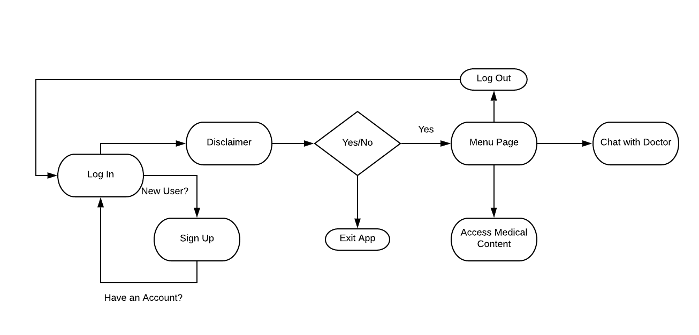
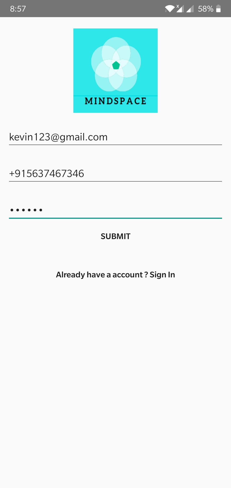
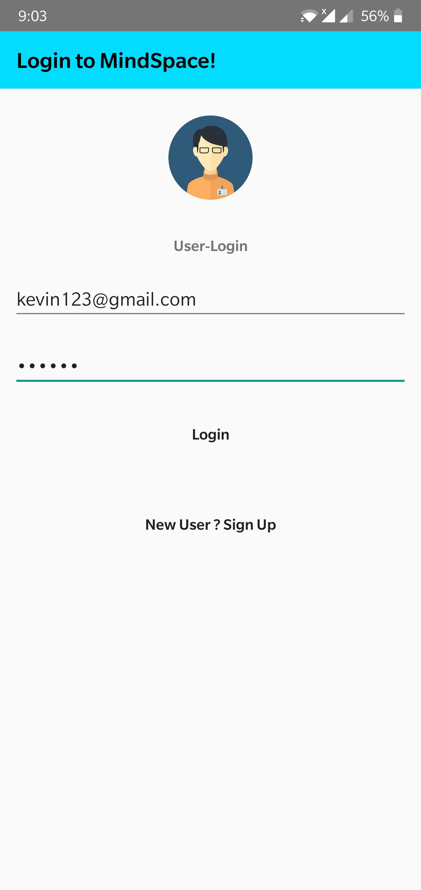
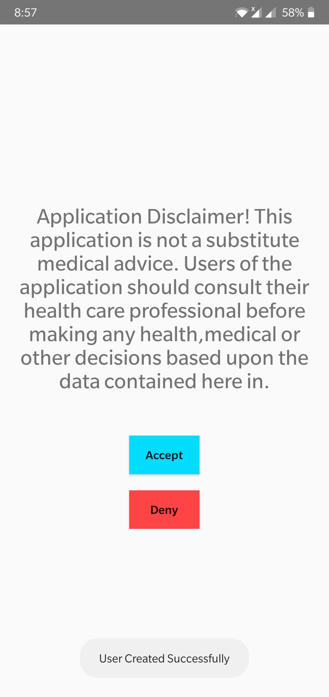
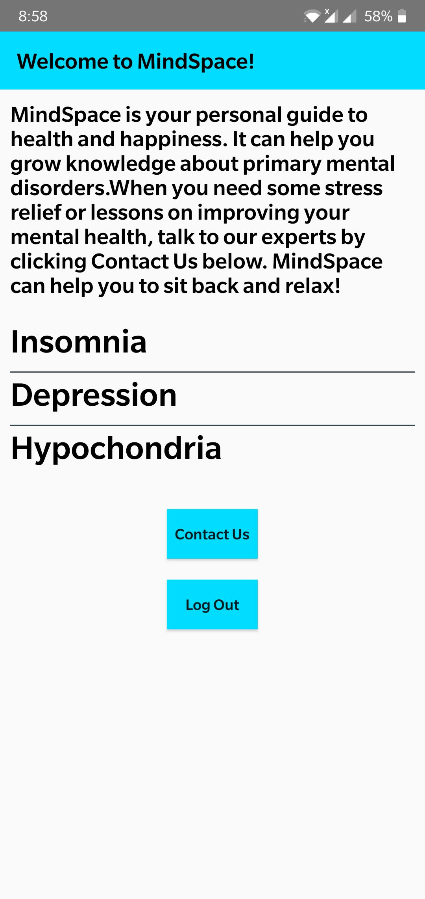
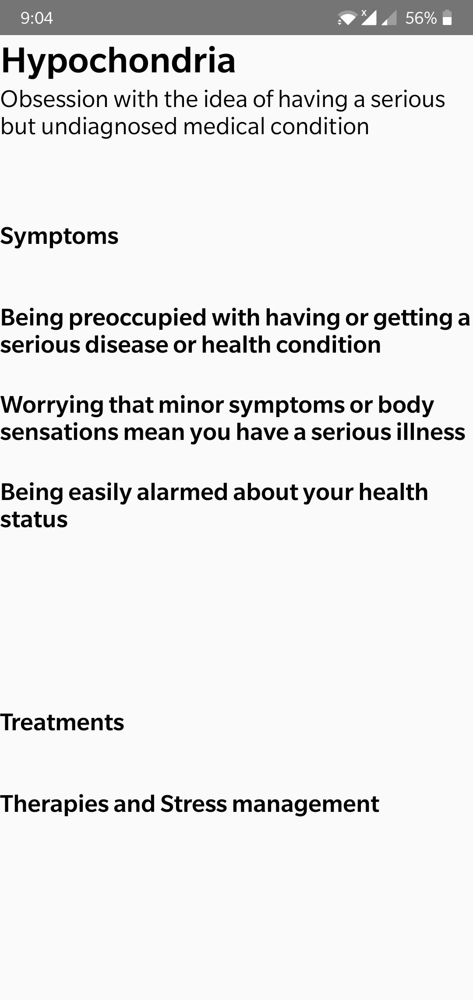
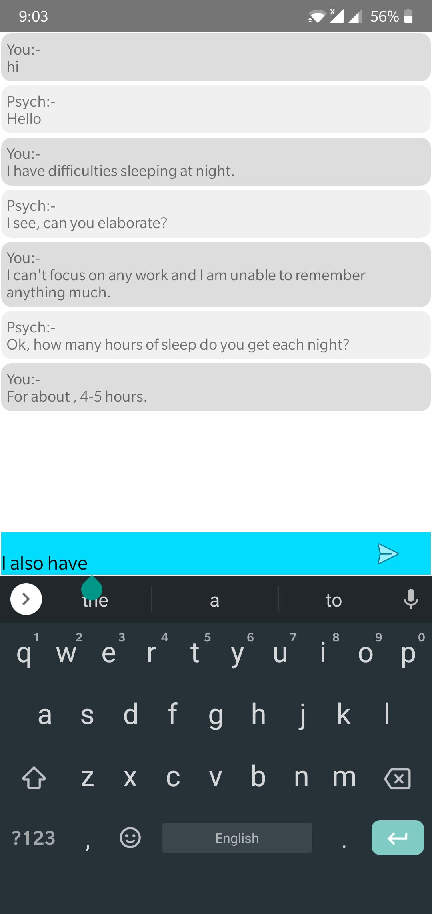
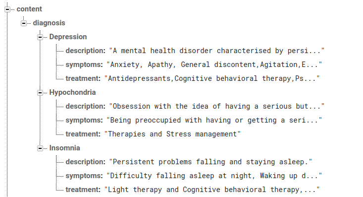
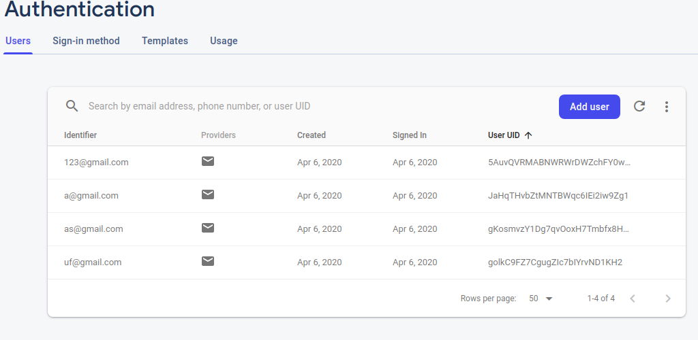

# MindSpace
An Android App for improving mental health and well being.This application was made as for screening task of MindHug Summer Internship 2020.

MindSpace is a simple personal guide to mental health and happiness. It can help you to grow knowledge about primary mental health disorders.It offers features that helps you releive stress and provide neccessary information or personal assistance from an expert psychiatrist on improving your health conditions gradually. 

#### Try out MindSpace 
[APK](https://github.com/UmaGunturi/MindSpace/blob/master/mindspace.apk)

Demo video link :

## Features of MindSpace
- Authentication of users
- Chat with psychiatrist
- Information about Common mental health disorders

## WorkFlow of MindSpace

## Runthrough of the application

|   |   |   |
|---|---|---|
|    |    |    |
|    |    |    | 

### Technologies Used
- Android Studio
- Firebase

### Firebase 
Firebase is a database as service provided by Google. It makes it very easy to use real time database in mobile application development.

#### Database

#### Authentication

In this project, Realtime database of Firebase was used to store the data about the various conditions. Since Firebase has NOSQL capabilities, it becomes very easy to store such data. Also, Firebase scales quickly and is very useful when data updates quickly.Other use of Firebase in this application is to serve as the backend for the Chat, which is a one-on-one messenging service between the user and a certified psychiatrist. 

## Limitations
- UI can be improved further
- Verified content is less as of now

## Future 
- Chat history can be deleted after a stipulated time for privacy concerns
- Confidentiality can be improved further

